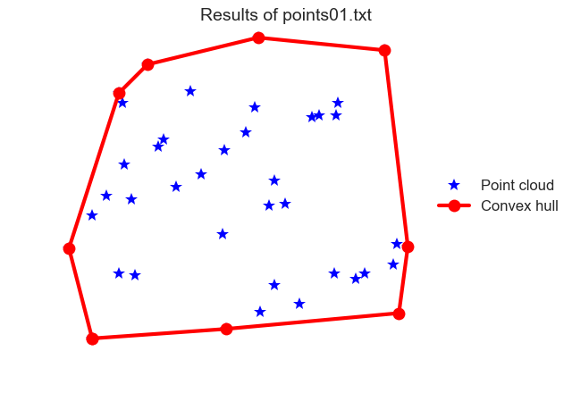
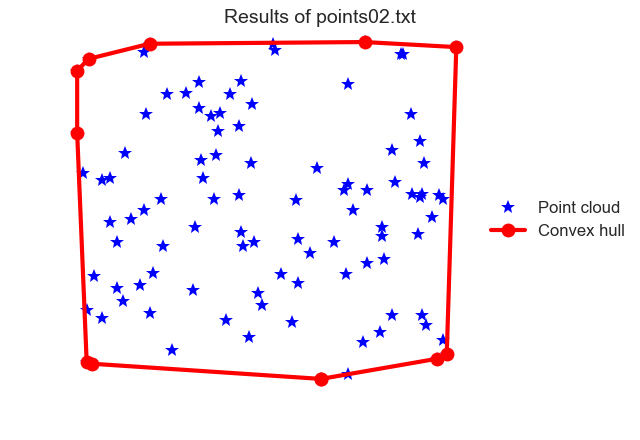
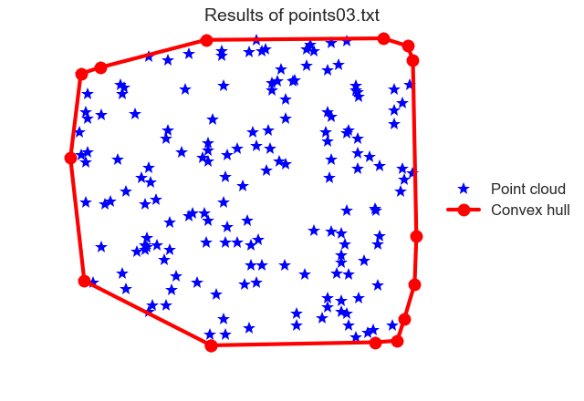
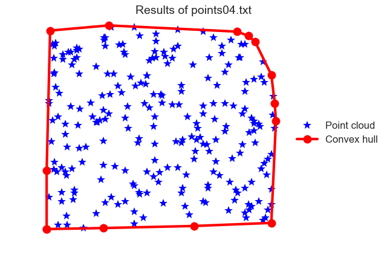
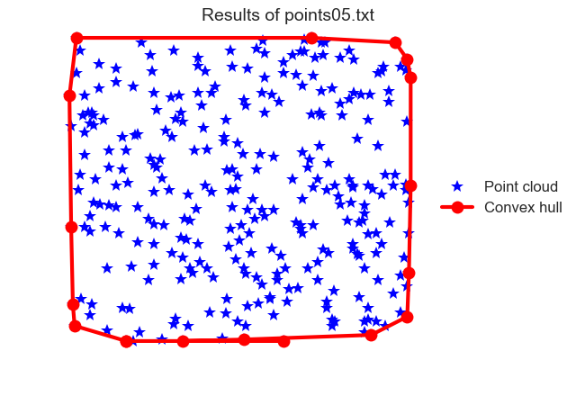
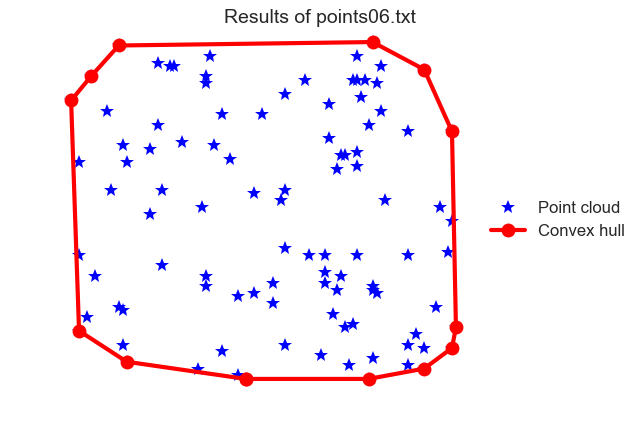
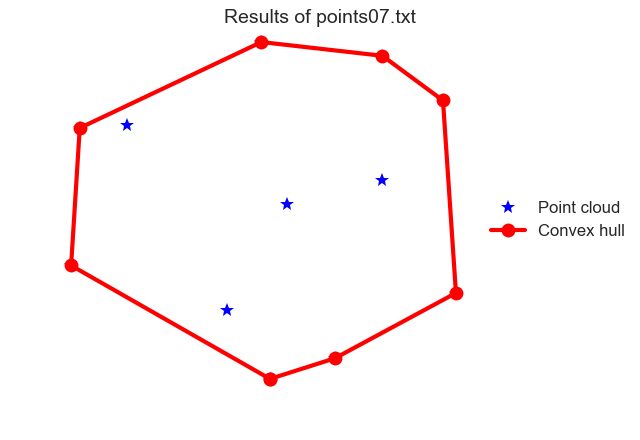
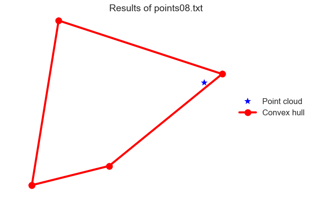
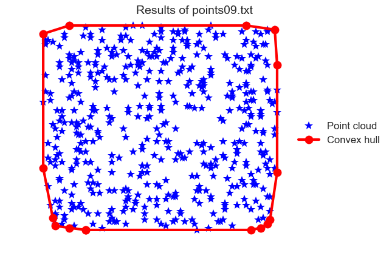
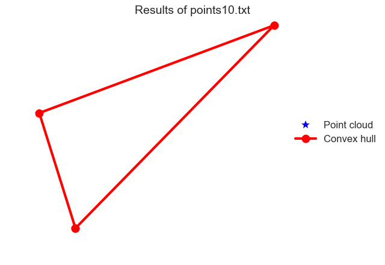

# Graham Scan for computing 2D convex hull

In this project I implement two-dimensional convex hulls using the Graham's scan
algorithm. 

# Usage

The main C++ executable is `cvxhull`, which takes a point cloud data set and
computes the corresponding convex hull:
```
$ ./cvxhull file

Given a point cloud stored in ./tests/file, compute the convex hull and store
the results in ./results/file.

positional arguments:
  file            the name of the file inside of ./tests/ that contains a 
                  point cloud
```

In addition to the main C++ executable, I've included two useful Python
executables which can add new data sets to explore.  The executable
`point_cloud` can be used to generate a point cloud:
```
$ ./point_cloud --help
usage: point_cloud [-h] [-n N] file

Generate a point cloud to compute a convex hull from

positional arguments:
  file              the name of the file inside of ./tests/ that will contain
                    the point cloud.

optional arguments:
  -h, --help        show this help message and exit
  -n N, --number N  the number of points to be generated in the cloud.

```

The executable `plotting` can be used to plot the convex hulls of a given point
cloud:

```
$ ./plotting --help
usage: plotting [-h] file

Plot convex hulls of a given point cloud

positional arguments:
  file        the name of the file inside of ./tests/ that you would like to
              plot

optional arguments:
  -h, --help  show this help message and exit
```

**Note**. The file `plotting` has the plotting library `seaborn` as a
dependency.

# Results













